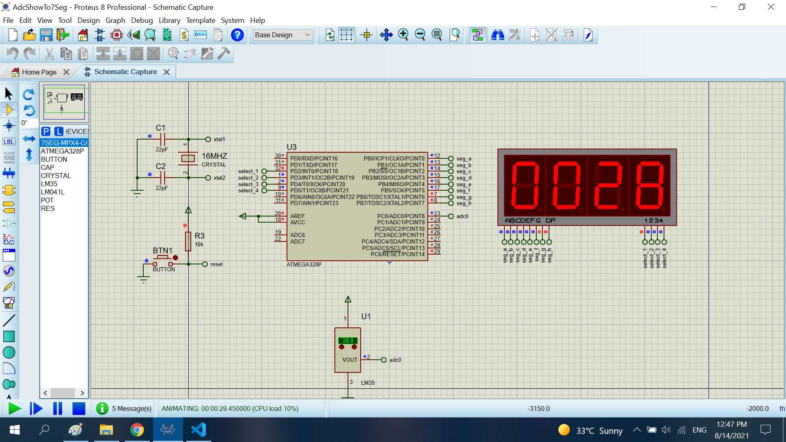

# Read data the LM35 

The project read the LM35 temperature. When show to 7segx4

## Features arduino

- Compiler      : avr_gcc
- Simulation    : proteus 8.8
- Atmega328p    : F_CPU= 8MHz

## Features Arduino's ADC

- Div clock     : 128                                   
- V_ref         : 5v from A_REF pin (pin 20 of MCU), you need to connect A_REF and AVCC pin to 5v or source

## How to calculate temperature from register adc value

Link : https://github.com/nghiank97/Atmega328p_Project/tree/master/ThreeLM35

# Result

