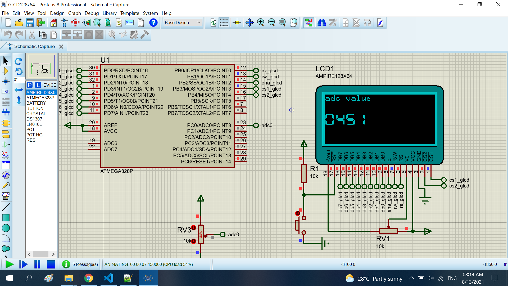

# Adc value show to the glcd 128x64

The project read the adc value from the resistor. When show to the glcd128x64

## Features arduino

- Compiler      : avr_gcc
- Simulation    : proteus 8.8
- Atmega328p    : F_CPU= 16MHz, Baudrate= 9600

## Adc resistor

- Vol : 5V
- Max value : 1023

## Result

