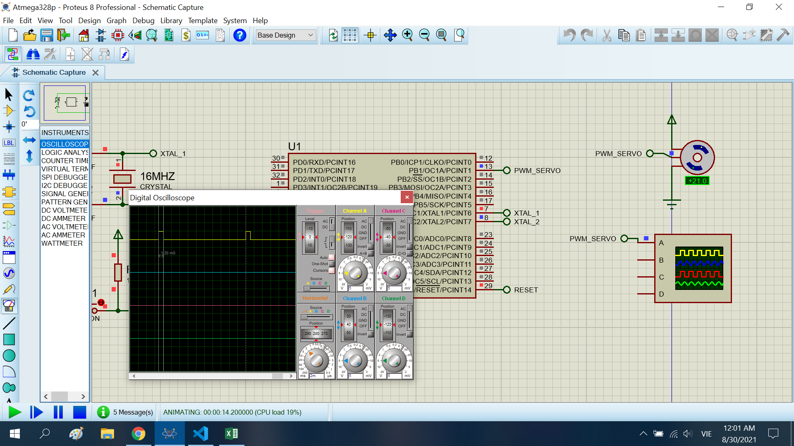
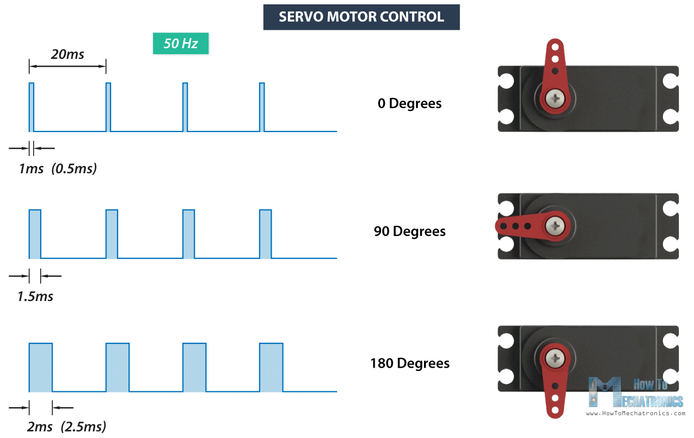

# Control servo motor

The project control servo motor. I using timer 1 to create pwm with 50Hz

## Features arduino

- Compiler      : avr_gcc
- Simulation    : proteus 8.8
- Atmega328p    : F_CPU= 8MHz


## Result


Error: 1.1 deg (I don't know that why)


## Caculator value timer
- **Step 1 : calculator value timer to delay 20ms or 50Hz**

I using F_CPU = 8MHz, mode timer 1 is normal with prescaler = 8, I have fclk T1 = 8M/8 = 1MHz. When, 1ms ~ TCNT1 = 0xffff-1k, 20Ms ~ TCNT1 = 0xffff-20k.
- **Step 2 : convert angle (0-180 degree) to time of pwm**



You see: 1ms - 0 deg, 2ms - 180 deg
```sh*
-> t = 1 + angle/180 (ms)
```
Note: t(ms)

Example : I want to set angle is 90 deg 
```sh*
-> t = 1+ 90/180 = 1.5 (ms)
```

- **Step 3 : convert time of pwm to value of timer**

I have: 1ms ~ TCNT1 = 0xffff-1k, 20Ms ~ TCNT1 = 0xffff-20k.
So, The value timer is : t*1000.
Example : I want to set the time is 1.5ms.
```sh*
-> Value timer = 1.5*1000 = 1500
```
- **Lastly: convert angle to value timer**

To convert the angle to value time: you need to go step 2, 3
Example : I want to convert 45 deg to the value timer

Step 2:
```sh*
-> t = 1 + angle/180 = 1 + 45/180 = 1.25 (ms)
```
Step 3:
```sh*
-> Value timer = 1.25*1000 = 1200
```
Simply : 
```sh*
-> Value timer = angle/180*1000 = angle*5.556
```

I made it in below __servo_put__ function

```sh*
extern void servo_put(int angle){
    time = (int)angle*5.556;
}

ISR (TIMER1_OVF_vect)
{
    if (status == LOW){
        status = HIGH;
        _set(PORT_SERVO,SERVO_PIN);
	    TCNT1 = (0xffff-(1000+time));
    }
    else{
        status = LOW;
        _clr(PORT_SERVO,SERVO_PIN);
        TCNT1 = (0xffff-(20000-time));
    }
}
```