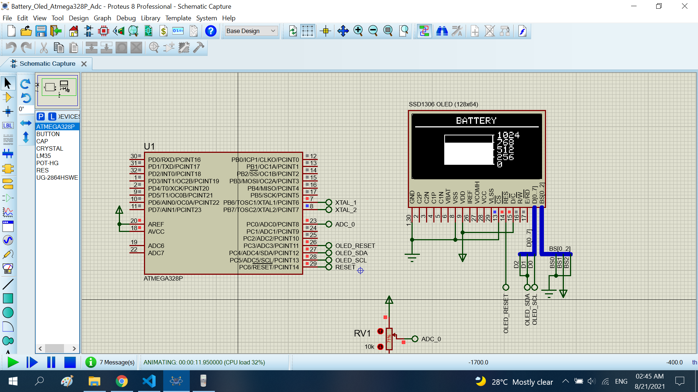

# Battery in Oled

The project read a adc value when draw like a battery in a ssd1306

## Features arduino

- Compiler      : avr_gcc
- Simulation    : proteus 8.8
- Atmega328p    : F_CPU= 16MHz, Baudrate= 9600

# Result

