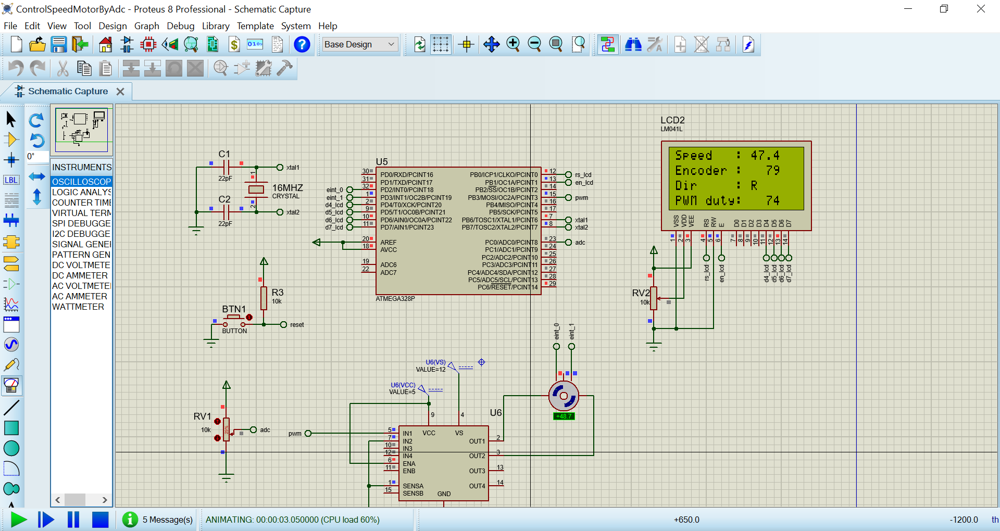

# Control Speed Motor by Adc

The project read the adc value of resistor when convert the adc value to pwm value. The pwm value use to control speed motor DC. Some special value show to the lcd 16x4

## Features arduino

- Compiler      : avr_gcc
- Simulation    : proteus 8.8
- Atmega328p    : F_CPU= 16MHz, Baudrate= 9600

## Features Arduino's ADC

- Div clock     : 128                                   
- V_ref         : 5v from A_REF pin (pin 20 of MCU), you need to connect A_REF and AVCC pin to 5v or source

## Features Arduino's PWM

- PWM's timer : timer 2
- F     : 15625 Hz (16MHz/1024)                                   

## How to calculate the pwm value from the adc value

The adc value is between 0 - 1023 and the pwm value is 0-255.
When,

```sh
    PWM value = (ADC value)*256/1024 = (ADC value)/4
```
## How to calculate the speed motor

I did in past project. Link reference : https://github.com/nghiank97/Atmega328p_Project/tree/master/ReadEncoderMotor

# Result

