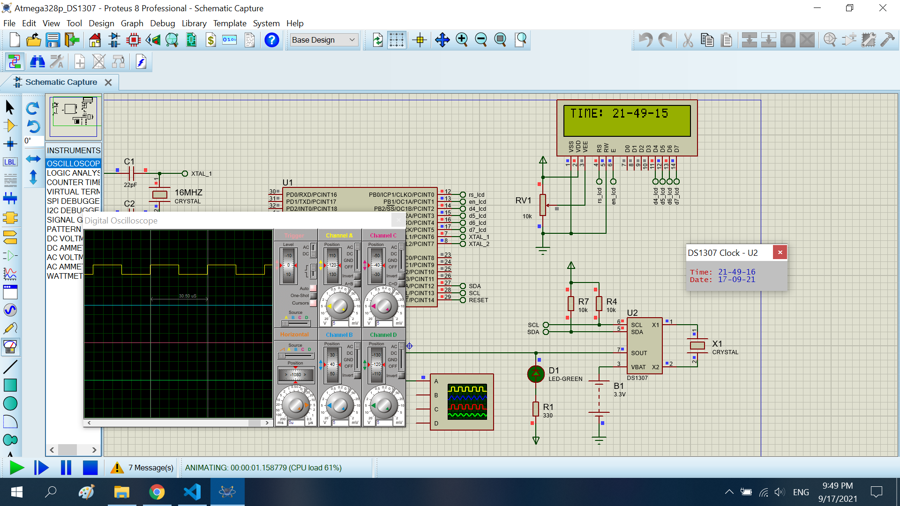

# The clock

The project create the clock using ds1307 ic. Show to the time to lcd. Beside, I create a pluse on SOUT pin

## Features arduino

- Compiler      : avr_gcc
- Simulation    : proteus 8.8
- Atmega328p    : F_CPU= 8MHz

## Result
