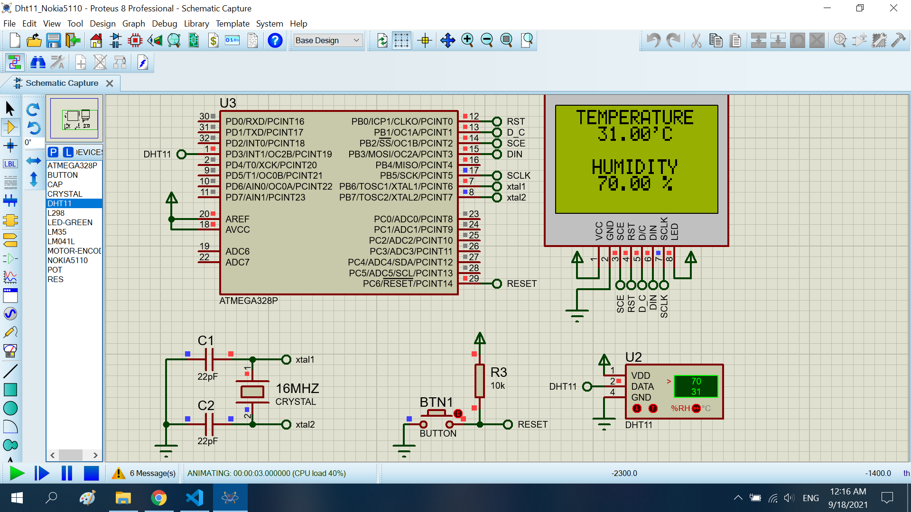

# Read the DHT11 IC 

The project read **temperature** and **humidity** using **dht11** show to **nokia5110**

## Features arduino

- Compiler      : avr_gcc
- Simulation    : proteus 8.8
- Atmega328p    : F_CPU= 16MHz

## Result

