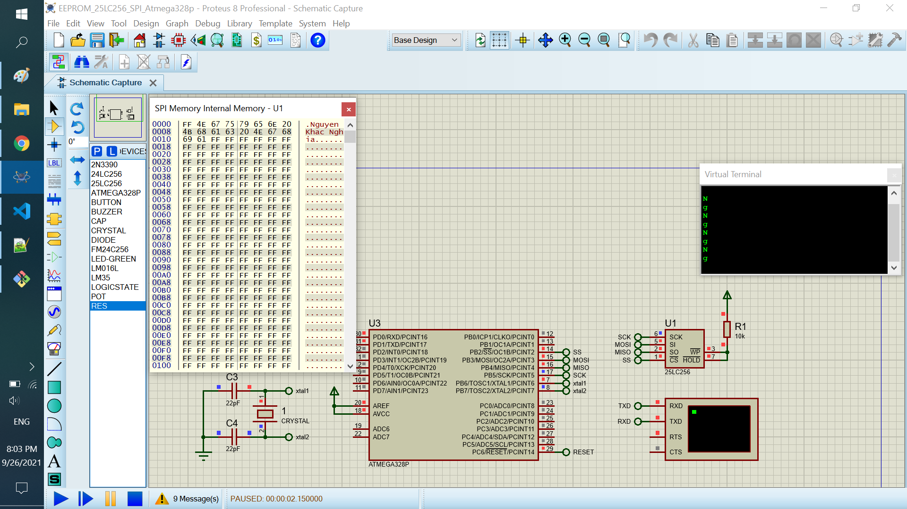

# EEPROM 25LC256 SPI

The project read and write the data in 25LC256. When send the data to serial

## Features arduino

- Compiler      : avr_gcc
- Simulation    : proteus 8.8
- Atmega328p    : F_CPU= 8MHz

# Result
