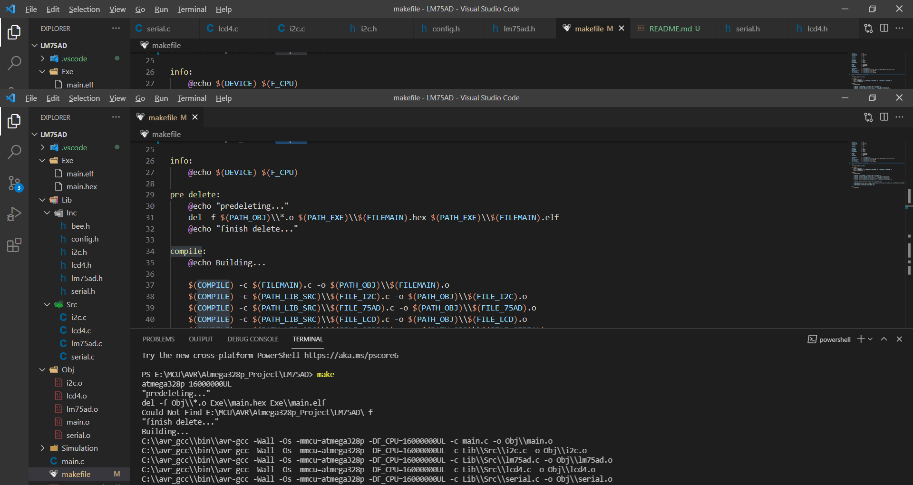
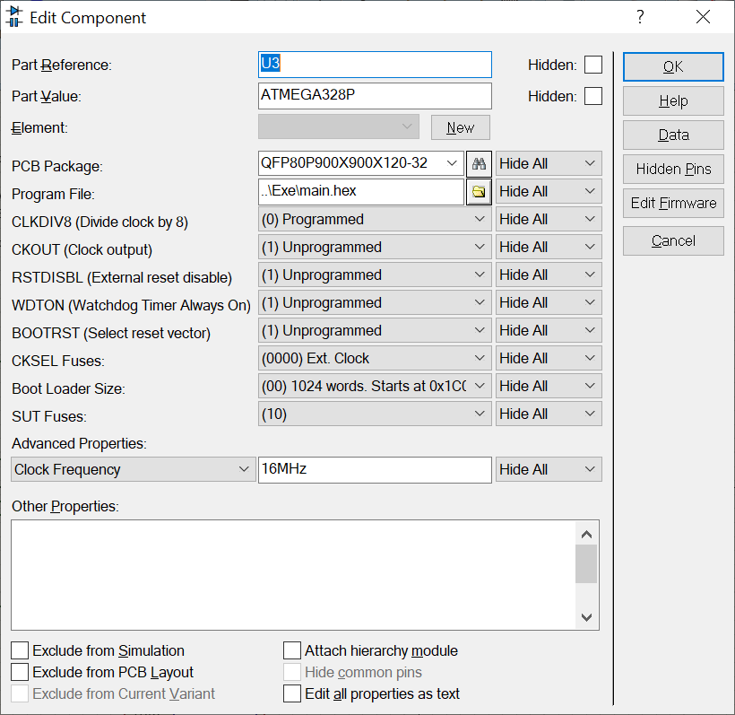
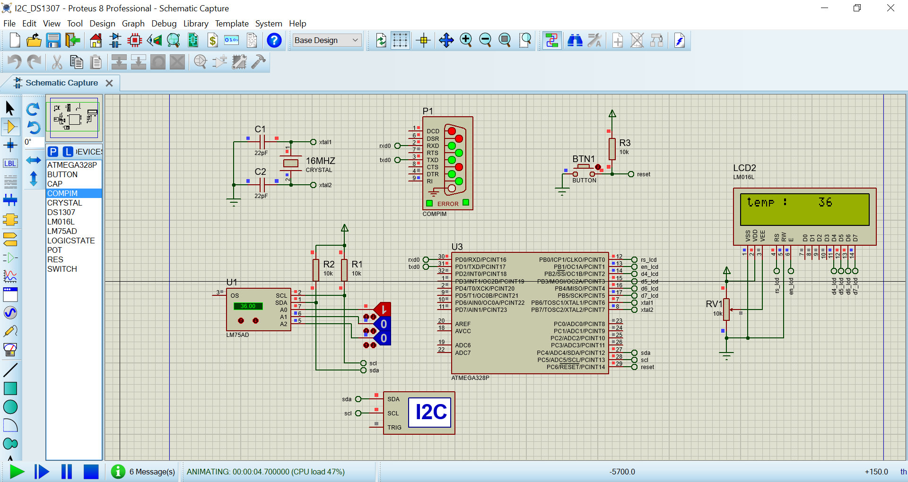
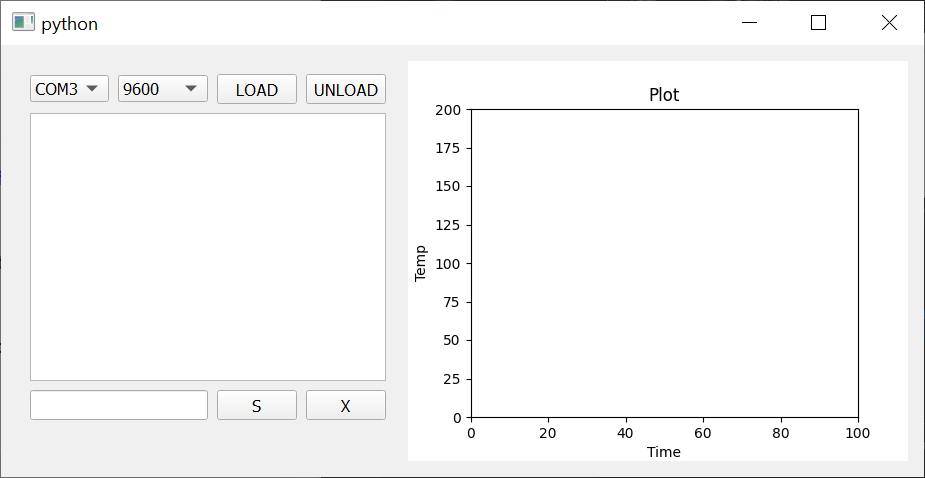
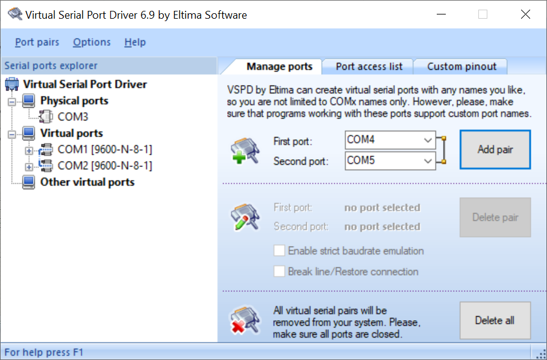
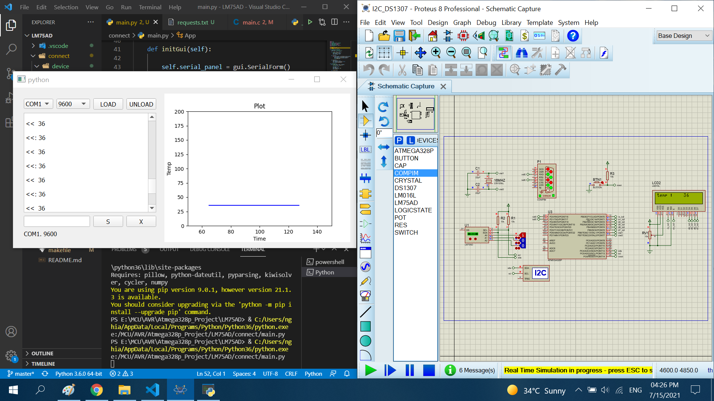

# Read data temperature LM75AD 

The project read the data temperature LM75AD, configuration register LM75AD. Then show data to Lcd16x2 and send data temperature to CPU via serial port using Atmega328p

## Features

- Compiler : avr_gcc
- Simulation : proteus 8.8
- Atmega328p : F_CPU= 16MHz, Baudrate= 9600

## How to run

run cmd

```sh
make build
```


config proteus file



add .hex file to proteus file



## How to connect with python via visual com port software

The project has graphic software to show the temperature from the sensor LM75ad to a computer or laptop. The graphic software is written on python-3.6. To run graphic software, you run file main.py in folder project

Image of graphic


The graphic software allow:
+ select com ports in your device
+ select baudrate 
+ load and unload connect between atmega328p and computer
+ show temperature

To connect, you must install a virtual com port software


# Result

