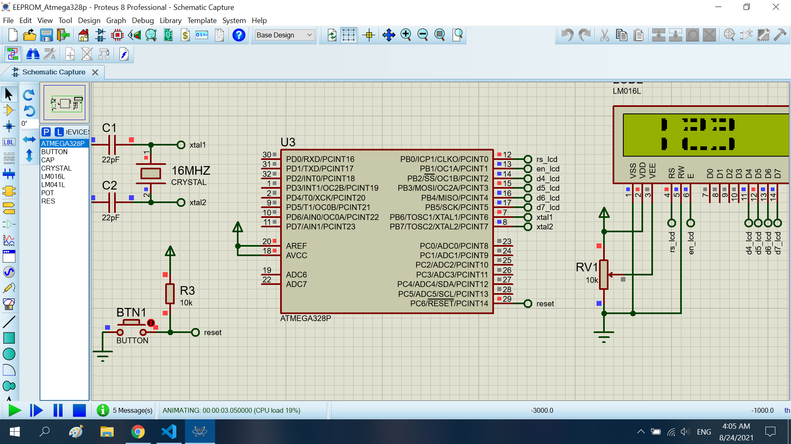

# PRINT A BIG NUMBER TO LCD16x2

The project print a "123" string to the LCD16x2

## Features arduino

- Compiler      : avr_gcc
- Simulation    : proteus 8.8
- Atmega328p    : F_CPU= 8MHz

# Result
