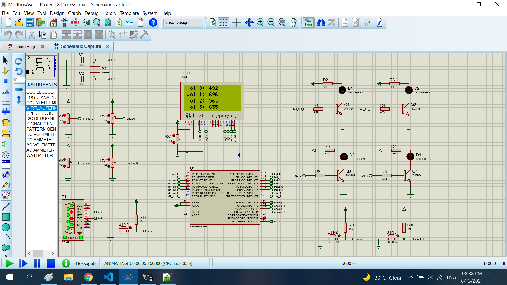
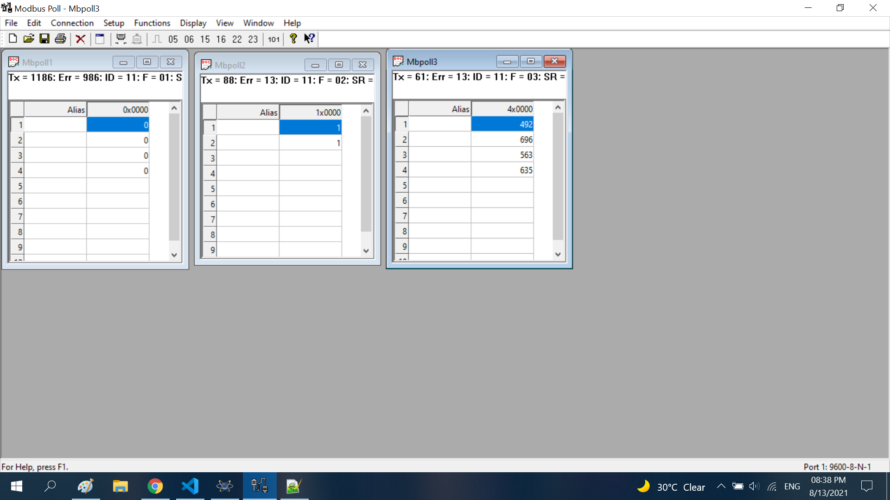

# Modbus Ascii

The project connect with CPU by a modbus ascii protocol.

## Features arduino

- Compiler      : avr_gcc
- Simulation    : proteus 8.8
- Atmega328p    : F_CPU= 16MHz, Baudrate= 9600

## Map modbuss ascii

- Address modbus : 0x0B
- Function 01: 00001-> 00004
- Function 02: 10001-> 10002
- Function 03: 40001-> 40004

## Result

