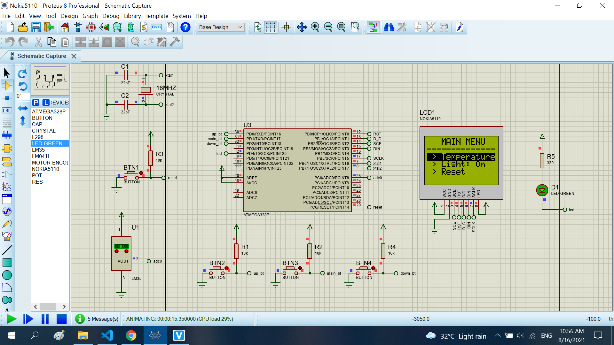
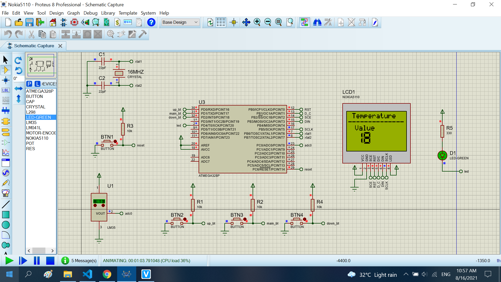

# Form LM35 and Nokia5110

The project read the sensor LM35. When, I show to nokia5110

## Features arduino

- Compiler      : avr_gcc
- Simulation    : proteus 8.8
- Atmega328p    : F_CPU= 16MHz

# Result

Base form.

Temperature form.

