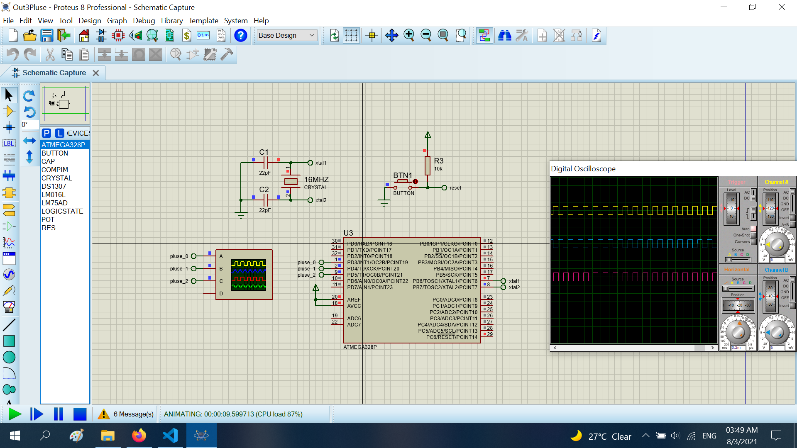

# Create 3 Pluse In Atmega328P At Same This Time
The project create 3 pluse on 3 pin of atmega328p at same this time with different cycle

## Features

- Compiler : avr_gcc
- Simulation : proteus 8.8
- Atmega328p : F_CPU= 16MHz

# Result
