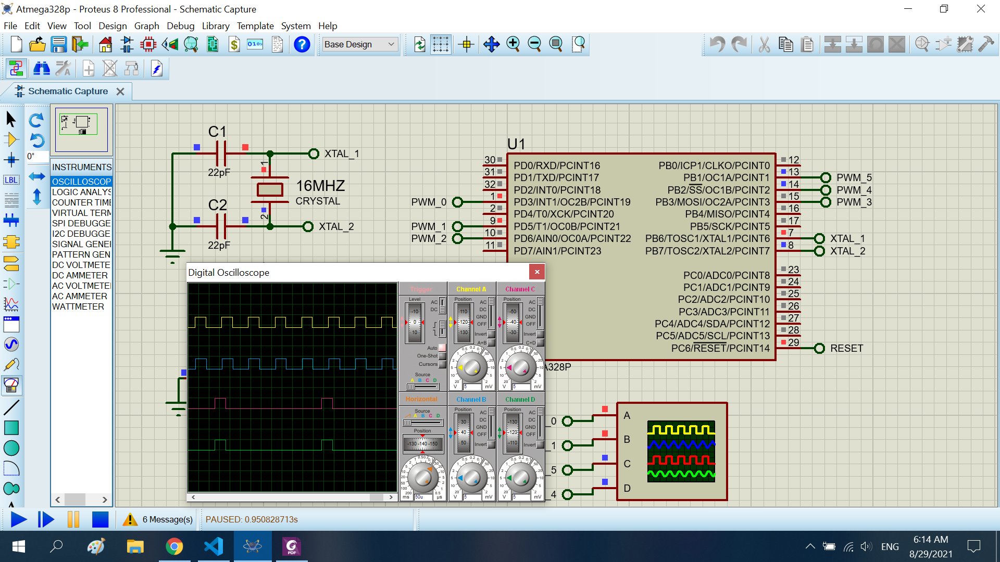

# Create pwm pluse

The project create pwm pluse in atmega328p

## Features arduino

- Compiler      : avr_gcc
- Simulation    : proteus 8.8
- Atmega328p    : F_CPU= 16MHz

## Result


## main.c

```sh
#include "Lib/Inc/config.h"
#include "Lib/Inc/pwm.h"

int main(void)
{
    CONFIG_EXTER_CLOCK();
    pwm_put(PWM_PB1,102);
    pwm_put(PWM_PB2,102);
    pwm_put(PWM_PD3,102);
    pwm_put(PWM_PD5,102);

    while (1)
        {
        }
}
```