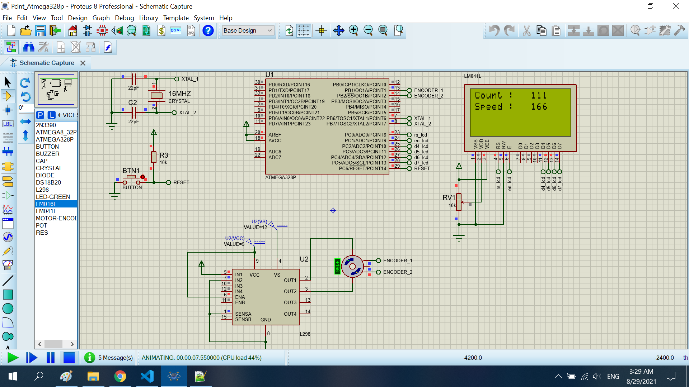

# Read speed motor using pcint

The project read speed motor using pcint pins

## Features arduino

- Compiler      : avr_gcc
- Simulation    : proteus 8.8
- Atmega328p    : F_CPU= 16MHz

## How to calculate speed motor

I delay t ms to read pluse number from encoder. I calculator average speed by formula 

```sh
    (average speed) = (pluse number)/4/(t*10^-3)*60/(resolution of encoder) (rpm)
```
Note: I div 4 not div 2

## Exmaple

You read 110 pluse of encoder from 2 phase in 100m delay. Resolution of encoder is 100

```sh*
    (average speed) = 110/4/(100*10^-3)*60/100 = 165 (rpm)
```

# Result
