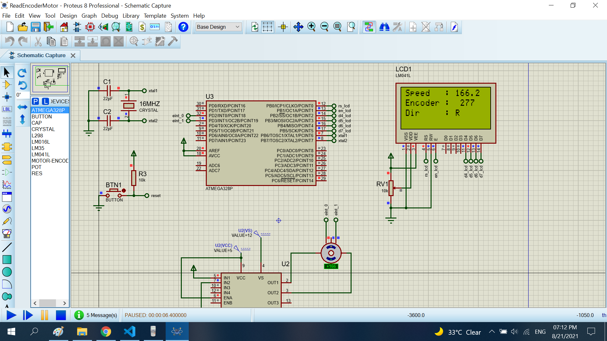

# Read speed motor

The project read speed motor using encoder sensor.When I show speed,direction and number of pluse to LCD16x4

## Features arduino

- Compiler      : avr_gcc
- Simulation    : proteus 8.8
- Atmega328p    : F_CPU= 16MHz, Baudrate= 9600

## Features Encoder

- Resolution      : 100                                   
- Number of phase : 2 (A,B)

## How to calculate speed motor from number of pluse

I delay 500ms to read pluse number from encoder. I using 2 phases to determine direction of motor.
From pluse number from encoder, I calculator average speed by formula 

```sh
    (average speed) = (pluse number)/2/(500m)*60/(resolution of encoder) (rpm)
```
When :
- pluse number : pluse number of 2 phases
- 500ms : time read encoder
- 60 : 1 minute = 60s

## Exmaple

You read 277 pluse of encoder from 2 phase in 500m delay. Resolution of encoder is 100

```sh
    (average speed) = 277/2/(0.5)*60/100 = 166.2 (rpm)
```

## Result

