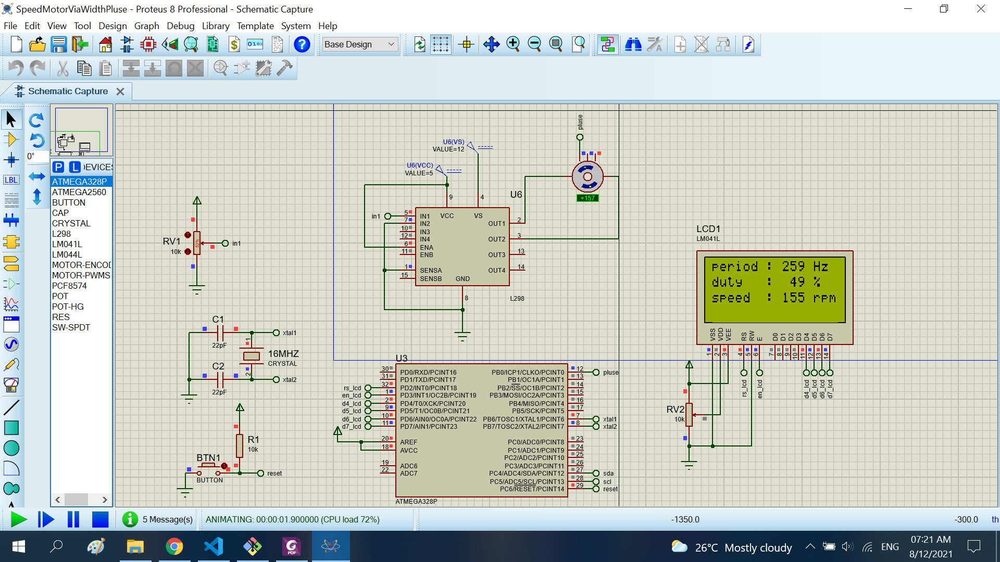

# Speed motor via the width pluse

The project read the speed motor via the width pluse. I show infomations to lcd16x4

## Features arduino

- Compiler      : avr_gcc
- Simulation    : proteus 8.8
- Atmega328p    : F_CPU= 16MHz

## How to calculate the speed motor
```sh
    speed motor = 60/(t*resolution) (rpm)
```
# Result

