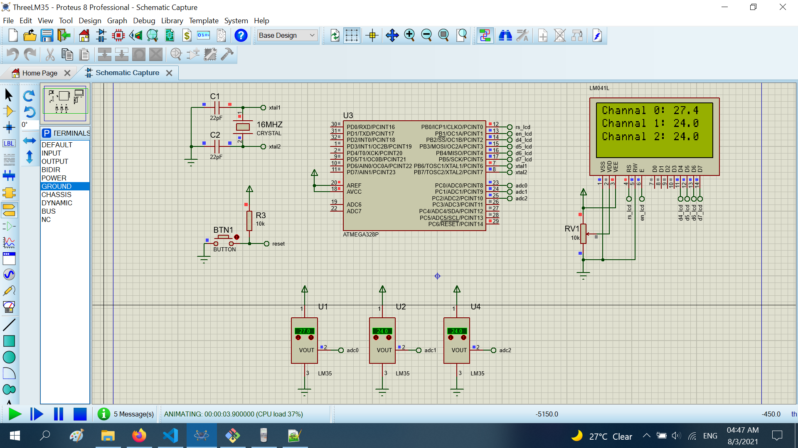

# Read data 3 temperature LM35 

The project read the data 3 temperature LM35 as channel temperature. Temperatures show to LCD16x4

## Features arduino

- Compiler      : avr_gcc
- Simulation    : proteus 8.8
- Atmega328p    : F_CPU= 16MHz, Baudrate= 9600

## Features Arduino's ADC

- Div clock     : 128                                   
- V_ref         : 5v from A_REF pin (pin 20 of MCU), you need to connect A_REF and AVCC pin to 5v or source

## How to calculate temperature from register adc value

Fristly, I calculate vol value from ADC, you must determine below parameters
+ ADC's register value  : saved at ADCW  (ADCW)
+ ADC's resolution      : 10 bit - 1024  (Resolution)
+ Vref                  : 5v             (V_ref)
```sh
    Real Vol = ADCW/Resoluation*5 = ADCW/1024*5
```
Secondly,I convert from real vol to temperature by LM35's datasheet. With LM35, increase 10mV -> increase 1*C 
```sh
    Real temperature = (Real Vol) /10m = (Real Vol) *100 = ADCW/1024*5*100 = ADCW*0.488
```
# Result

