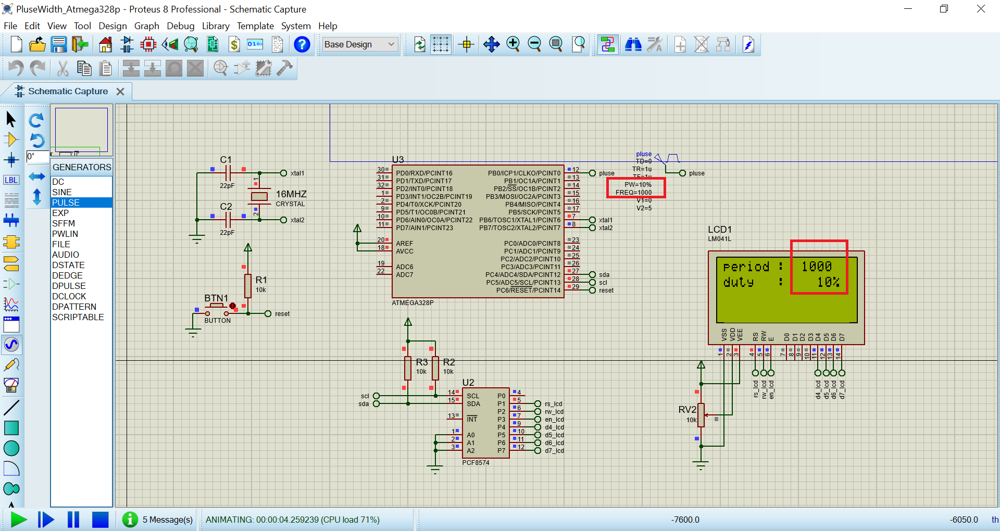

# Read the duty's pluse

The project read the duty's pluse and the period of pluse via the capture timer 1. When show to 16x4 by i2c 

## Features arduino

- Compiler      : avr_gcc
- Simulation    : proteus 8.8
- Atmega328p    : F_CPU= 16MHz

## Features Arduino's timer 1

- Div clock     : 8 or Tcyc = 5*10^-7 (s)                                   

# Result

